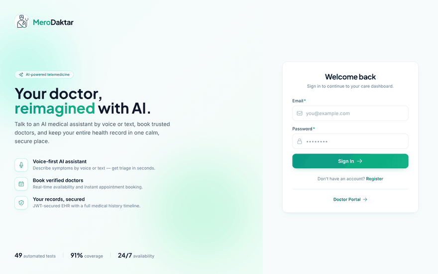
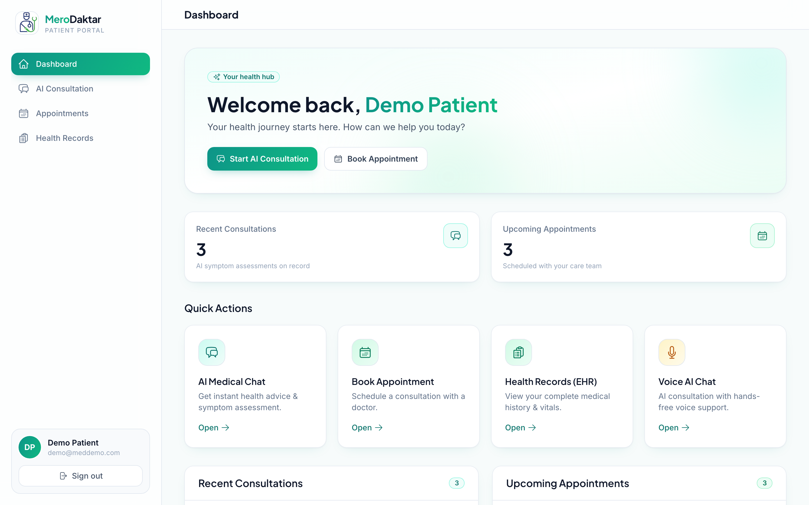
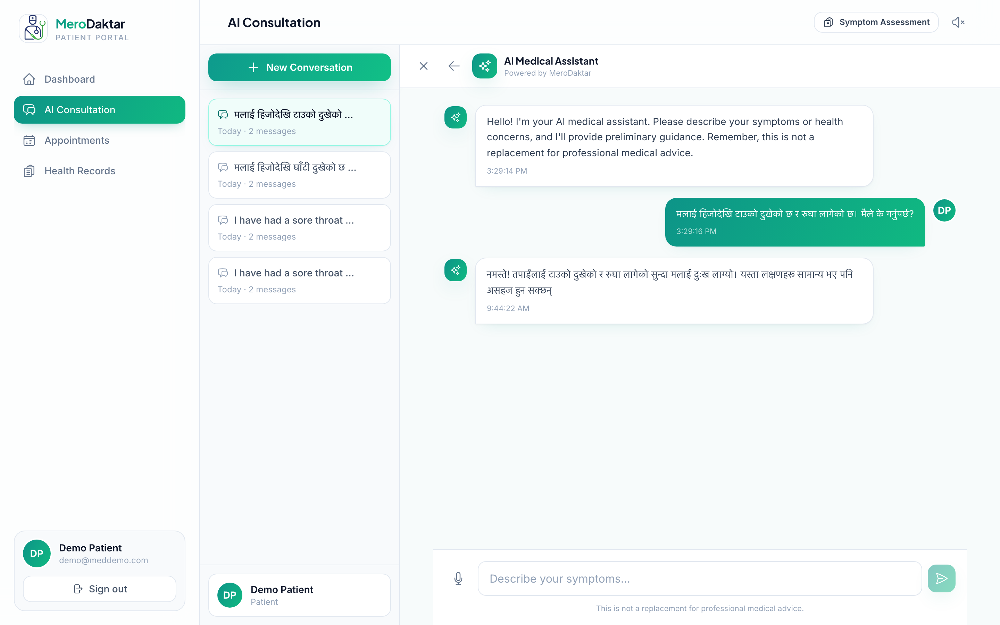
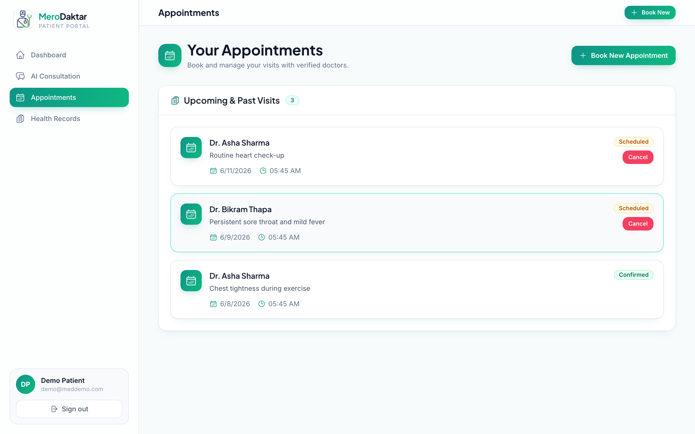
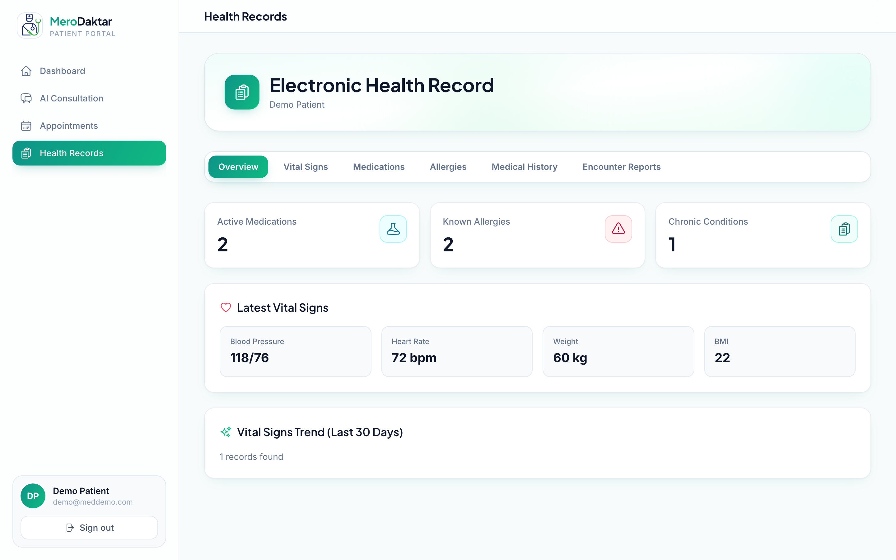
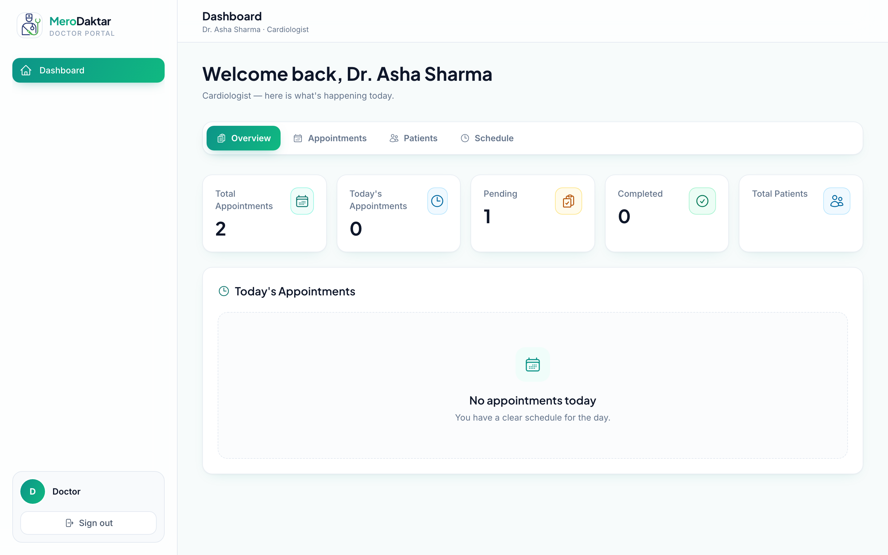
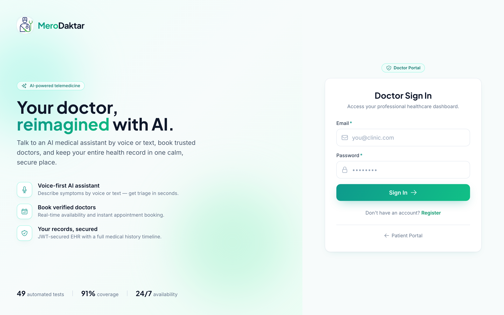
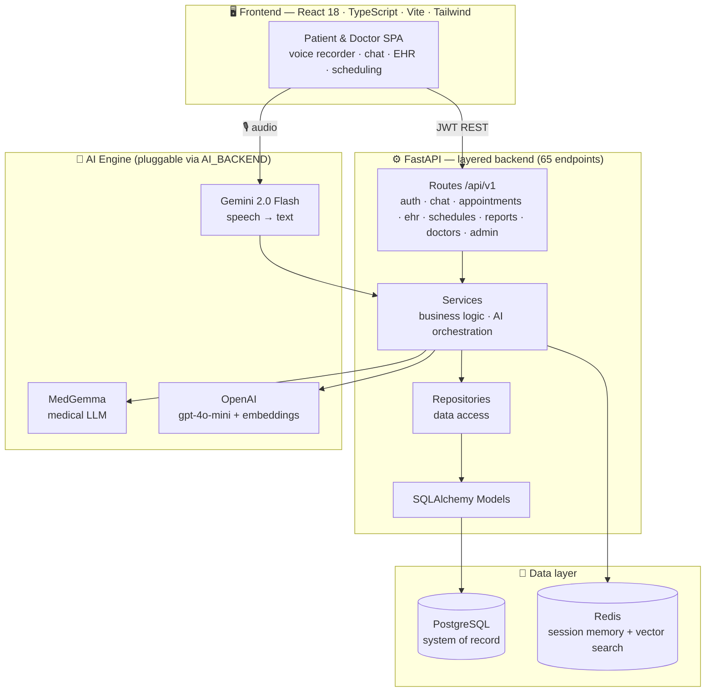
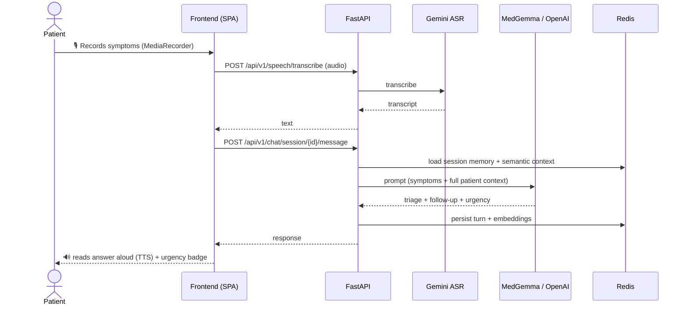

<div align="center">


# MeroDaktar — AI Telemedicine, reimagined

**Talk to an AI medical assistant by voice or text, book verified doctors, and manage your entire health record — in one calm, secure place.**

[](https://react.dev)
[](https://www.typescriptlang.org)
[](https://fastapi.tiangolo.com)
[](https://www.postgresql.org)
[](https://redis.io)
[](https://www.docker.com)


</div>

<div align="center">
  
  <br/><sub><i>Live walkthrough: sign-in · patient dashboard · AI consultation (Nepali) · appointments · health records · doctor portal</i></sub>
</div>

---

## ✦ What is MeroDaktar?

**MeroDaktar** ( *“My Doctor”* ) is a full-stack telemedicine platform that brings primary-care triage to anyone with a phone. A patient describes how they feel — **by voice or by typing** — and a medical-grade AI assistant runs a structured symptom interview, flags urgency, remembers the conversation, and can hand off to a **real, verified doctor** for an appointment. Every interaction is captured in a proper **Electronic Health Record (EHR)**.

It is not a chatbot demo. It is a layered, tested, production-shaped system: **65 REST endpoints**, a clean *routes → services → repositories → models* backend, a pluggable AI engine, Redis-backed conversation memory with semantic search, and a complete doctor portal.

---

## ✦ Why it stands out

<div align="center">

| | | |
|:--:|:--:|:--:|
| **🎙️ Voice-first triage** | **🧠 Medical-grade AI** | **🔁 It remembers** |
| Speak your symptoms in **Nepali or English** — Gemini transcribes, the AI replies in your language, and reads answers aloud. | Pluggable engine via one env var — **Gemini**, **MedGemma**, or **OpenAI** — same prompts, swappable backend. | Redis session memory + **semantic vector search** mean no repeated questions across a consultation. |
| **🩺 Real doctor handoff** | **📋 Full EHR** | **🛡️ Built to last** |
| Live availability, time-slot booking, and a complete doctor dashboard with encounter notes. | Vitals, allergies, medications and a chronological encounter timeline per patient. | **49 automated tests · 91% coverage**, JWT auth, Dockerised infra. |

</div>

### 📊 By the numbers

| Metric | Value |
|---|---:|
| REST API endpoints | **65** (27 POST · 24 GET · 8 PUT · 5 DELETE · 1 PATCH) |
| Backend Python | **7,630 lines** across 68 modules |
| Frontend TypeScript / React | **6,536 lines** — 9 screens + a shared design system |
| Feature modules | **11** (auth, chat, appointments, EHR, schedules, reports, doctors, dashboard, voice ASR, users, admin) |
| Data models | **8** (User, Doctor, Appointment, Schedule, Encounter, Consultation, EHR, Report) |
| Automated tests | **49** — 31 unit · 15 integration · 3 end-to-end |
| Test coverage | **91%** |
| AI engines | **3** — MedGemma · Gemini 2.0 Flash (ASR) · OpenAI (`gpt-4o-mini` + embeddings) |
| Contributors | **3** |
| Total codebase | **~15,500 lines** |

---

## ✦ Demo — the patient journey

<table>
  <tr>
    <td width="50%"><br/><sub><b>🏠 Patient dashboard</b> — health hub with quick actions, recent consultations & upcoming visits</sub></td>
    <td width="50%"><br/><sub><b>💬 AI consultation</b> — voice + text symptom triage with conversation history</sub></td>
  </tr>
  <tr>
    <td><br/><sub><b>📅 Appointments</b> — browse doctors, pick a slot, book & manage</sub></td>
    <td><br/><sub><b>📋 Health records (EHR)</b> — vitals, allergies, medications & encounter timeline</sub></td>
  </tr>
  <tr>
    <td><br/><sub><b>🩺 Doctor portal</b> — overview, appointments, patients & schedule management</sub></td>
    <td><br/><sub><b>🔐 Separate doctor portal</b> — dedicated, JWT-secured sign-in</sub></td>
  </tr>
</table>

> The flows below are live in the app today.

```
  Sign up / Log in ─▶ Dashboard ─▶ "AI Consultation"
        │                              │
        │            ┌─────────────────┴─────────────────┐
        │         🎙️ Speak symptoms              ⌨️  Type symptoms
        │            └─────────────────┬─────────────────┘
        │                              ▼
        │              AI triages → asks follow-ups → flags urgency 🟢🟡🔴
        │                              ▼
        │              "This looks moderate — let's book a doctor."
        ▼                              ▼
   Health Records (EHR)  ◀──  Book Appointment ─▶  Doctor reviews & adds encounter notes
```

**1. Voice or text consultation.** The patient opens *AI Consultation*, taps the mic (or types), and describes their symptoms. Gemini transcribes speech in real time; the AI assistant conducts a guided symptom interview and classifies urgency as **routine / moderate / emergency**.

**2. Memory that follows the conversation.** Redis stores the session and a semantic index of prior turns, so the assistant never asks the same question twice and keeps full patient context (demographics, history, EHR) in every prompt.

**3. Seamless doctor handoff.** When the patient needs a clinician, they book a real appointment against a doctor's live availability. Doctors get a full dashboard — appointments, patient records, and per-visit **encounter** notes that flow back into the EHR.

**4. One health record.** Vitals, allergies, medications and a chronological encounter timeline live in the patient's EHR, viewable any time.

---

## ✦ Architecture



### Voice consultation flow



---

## ✦ Feature matrix

| Area | Patient | Doctor |
|---|---|---|
| **AI consultation** | Voice + text symptom triage, urgency flags, conversation history | — |
| **Memory & context** | Redis session memory, semantic search, full EHR context in prompts | — |
| **Appointments** | Browse doctors, live slots, book / cancel | Manage availability, confirm / complete, cancel |
| **EHR** | Vitals, allergies, medications, encounter timeline | Read patient records, write encounter notes |
| **Reports** | AI-generated symptom-assessment reports | Patient-linked reports |
| **Auth & security** | JWT login / registration | Separate doctor portal & JWT |
| **Dashboards** | Health summary, recent consultations, upcoming visits | Stats, schedule, patient & appointment management |

---

## ✦ Tech stack

**Frontend** · React 18 · TypeScript · Vite · Tailwind CSS · React Router · Axios · Heroicons
**Backend** · FastAPI · Uvicorn · SQLAlchemy · Pydantic v2 · python-jose (JWT) · passlib + bcrypt
**Data** · PostgreSQL · Redis (caching, session memory, vector search)
**AI** · Google MedGemma · Gemini 2.0 Flash (ASR) · OpenAI `gpt-4o-mini` & `text-embedding-3-small` · `google-genai`
**Tooling** · Docker Compose (postgres · pgadmin · redis) · pytest · pytest-asyncio · pytest-cov

---

## ✦ Design system

The frontend was rebuilt on a bespoke **“Health-Tech Gradient”** design system — deep-navy surfaces, violet→cyan gradients, glassmorphism and soft glow, with *Space Grotesk* display type over *Inter*. Everything renders from shared primitives so the whole product feels cohesive:

- `src/lib/ui.tsx` — `Button`, `Card`, `Input`, `Select`, `Field`, `Badge`, `StatCard`, `Spinner`, `Avatar`, `PageHeader`, `EmptyState`
- `src/components/layout/AppLayout.tsx` — responsive sidebar + top-bar shell for patient & doctor portals
- `src/components/layout/AuthLayout.tsx` — split hero + form for sign-in / sign-up
- `tailwind.config.js` + `src/index.css` — design tokens, animations and glass utilities

---

## ✦ Project structure

```
merodaktar/
├── app/                      # FastAPI backend (7,630 LOC · 68 modules)
│   ├── api/v1/               # 11 route modules · 65 endpoints
│   ├── services/             # business logic + AI orchestration
│   ├── repositories/         # data-access layer
│   ├── models/               # 8 SQLAlchemy models
│   ├── schemas/              # Pydantic request/response models
│   ├── core/                 # security, middleware, exceptions
│   ├── config/               # settings + database
│   └── migrations/           # schema migrations
├── frontend/                 # React + TypeScript SPA (6,536 LOC)
│   └── src/
│       ├── components/        # 9 feature screens
│       ├── components/layout/ # AppLayout (sidebar shell) + AuthLayout
│       └── lib/ui.tsx         # shared design-system primitives
├── tests/                    # 49 tests — unit · integration · e2e
├── docker-compose.yaml       # postgres + pgadmin + redis
└── requirements.txt
```

---

## ✦ Quick start

### 1. Infrastructure (Docker)

```bash
docker compose up -d        # starts postgres, pgadmin, redis
```

### 2. Backend

```bash
python -m venv .venv && source .venv/bin/activate
pip install -r requirements.txt
cp app/.env.example app/.env     # add your DB url + AI keys (MEDGEMMA / OPENAI / GEMINI)
uvicorn app.main:app --reload    # http://localhost:8000  ·  docs at /docs
```

> Switch AI engines with a single env var: `AI_BACKEND=gemini` (chat + embeddings + voice on one key), `AI_BACKEND=openai`, or `AI_BACKEND=medgemma`.

### 3. Frontend

```bash
cd frontend
npm install
npm run dev                  # http://localhost:5176
```

### 4. Tests

```bash
pytest                       # 49 tests
pytest --cov=app             # with coverage (~91%)
```

---

## ✦ Built by

MeroDaktar is the work of three engineers. Every contributor's original commits are preserved in this branch's history.

| | Contributor | Focus |
|:--:|---|---|
| 🧱 | **[Utshav Paudel](https://github.com/Utshav-paudel)** | Project lead & architecture — core platform, layered backend refactor, EHR, appointments, doctor portal, MedGemma integration, test suite, full UI redesign |
| 🎙️ | **Sumit Thokar** | Voice AI — Gemini speech transcription (ASR) and in-chat voice-input recording |
| 🧠 | **Shishir Bhattarai** | Chat memory & medical-chat API, appointment management and dashboard UX |

```bash
# every contributor's work is in the history of this branch:
git shortlog -sne
```

---

## ✦ License

Released for educational and portfolio purposes. © 2025 the MeroDaktar team.

<div align="center">

**MeroDaktar** — *your health, one tap away.*

</div>
